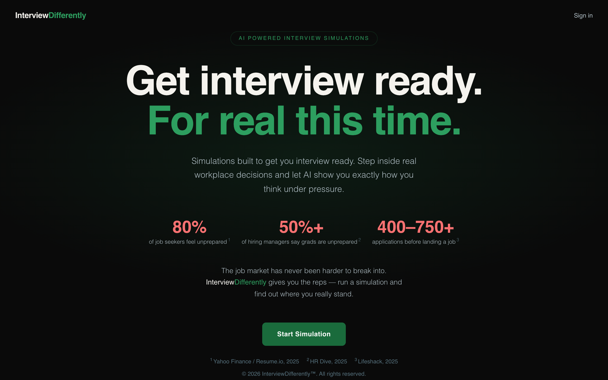
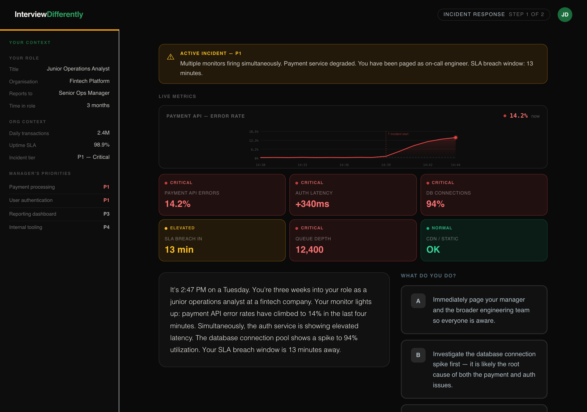

<div align="center">
  
  <h1>InterviewDifferently</h1>
  <p>AI-powered career simulations for early-career professionals.</p>
</div>

<br />

<div align="center">
  
</div>

<br />

<div align="center">
  
</div>

---

## The problem

A typical university career centre serves 3,000–5,000 students with two or three coaches. Students graduate having read about professional environments but never having practiced inside one. Résumé coaching gets them through the door. It does not prepare them to perform.

**80%** of job seekers feel unprepared to apply. **50%+** of hiring managers say recent graduates lack the judgment they need from day one. The gap is not knowledge — it is the absence of deliberate practice at the level of real decisions.

## What it does

Students choose a simulation track, read into a realistic workplace scenario, and make sequential decisions at each step. Every choice branches the scenario — different actions reveal different consequences.

At the end, the AI scores performance across four competency dimensions and delivers written feedback tailored to how the student actually responded. No two feedback reports are identical.

Each simulation track has a purpose-built instrument panel modelled on the real tools used in that field:

- **Incident Response** — live monitor tiles, a time-series error-rate chart with spike annotation, active incident record with elapsed timer
- **Business Case** — financial reference sidebar, key data table, structured decision framework
- **Risk & Compliance** — incident record with ID, discovery timestamp, live elapsed counter, regulatory flag, stakeholder map

## Simulation tracks

| Track | Scenario | Evaluated on |
|---|---|---|
| Incident Response | Payment API degradation — triage a live P1 with 13 minutes to SLA breach | Prioritization logic, stakeholder communication, root cause reasoning, confidence under pressure |
| Business Case | Magazine launch viability — model unit economics and make a go/no-go recommendation | Quantitative accuracy, structured reasoning, challenging assumptions, communication clarity |
| Risk & Compliance | Credential exposure — discover plaintext passwords in a shared internal document | Escalation path, risk calibration, regulatory awareness, communication clarity |

## Architecture

```
Frontend (React + Vite + TypeScript)  →  Vercel
Backend API (NestJS + TypeScript)     →  Railway
Shared types package                  →  packages/types
```

Planned additions: PostgreSQL (Railway), Redis session state (Railway), Anthropic Claude API for AI evaluation, Clerk for institutional SSO.

## Repo structure

```
/apps
  /web      React frontend — simulation engine, scenario sidebar, live metrics display, feedback
  /api      NestJS backend — scenario service, session manager, scoring engine
/packages
  /types    Shared TypeScript interfaces — Scenario, ScenarioNode, ChartConfig, ScenarioDisplay, User, Score
/docs
  /         Screenshots and design assets
```

## Scenario data model

All simulation content lives in `apps/web/src/lib/scenarios.ts` and is fully typed via `packages/types`. Swapping static config for API responses requires only updating `apps/web/src/services/scenariosService.ts`.

Each scenario defines:
- **Nodes** — branching decision and transition steps with narrative and choices
- **Context panels** — per-node live metrics displayed as monitor tiles, data tables, or finding cards
- **Chart config** — time-series data for the metric chart (ops track)
- **Display config** — sidebar sections, alert banner, incident metadata, context display style
- **Rubric** — competency dimensions used to score the session

## Build phases

| Phase | Scope | Status |
|---|---|---|
| 1 | Student simulation — 3 tracks, branching engine, scenario-specific instrument panels, scored feedback | ✅ In progress |
| 2 | No-code scenario builder — React Flow canvas, node editor, rubric templates, validation, publish | 🔜 Next |
| 3 | Auth — Clerk integration, institutional email sign-in, student and admin roles | Planned |
| 4 | AI feedback — Claude API replaces template scoring; structured feedback per competency dimension | Planned |
| 5 | Score persistence — database-backed results, running competency profile per student across simulations | Planned |
| 6 | Institution analytics — competency heatmap, cohort views, drop-off analysis, CSV/PDF export | Planned |

Phases 2 and 3 can run in parallel. Phase 4 is blocked on Phase 3 (AI feedback requires an authenticated user ID). Phases 5 and 6 are sequential — analytics has nothing to show until persistence is in place.

→ [Phase 2 technical delivery spec](docs/phase2-builder-spec.md)
