# Release notes

What changed in Interview Differently and LearnDifferently, newest first. Plain words, with screenshots. All data shown is fictional.

<!--
HOW TO ADD AN ENTRY
1. Timeline (top): add a bullet under the day (add a new "### <day>" heading at the top for a new day):
   - <status emoji> **<status>** · [Title](#heading-anchor) — one short sentence.
2. Copy one entry section below and paste it at the TOP of the entries (newest first). Heading = the title.
   Line under it = status badge, date, links. Then 2-3 plain sentences, an optional "Good to know" quote, screenshots.
3. Screenshots live in docs/screenshots/<feature>/ and are referenced as ../screenshots/<feature>/NN-name.jpg.
4. When an In review entry ships, change its badge (and the Timeline bullet).
Anchors: GitHub links a heading as lowercase, spaces to hyphens, punctuation removed.
This repo is public: fictional data only; no production configuration, contacts, funding or procurement details.
-->

## Timeline

🟡 in review (open PR) · 🟢 shipped

### Oct 7

- 🟡 **In review** · [My profile](#my-profile-one-profile-per-person-shared-on-the-learners-terms) — One profile per person; the learner chooses who sees it; complete needs a resume.
- 🟡 **In review** · [Profile required by a cohort](#a-cohort-can-require-the-profile-and-a-refresh) — A cohort can require the profile first and a refresh every few months.
- 🟡 **In review** · [Talent management](#talent-management-for-staff-notes-support-follow-ups-search-and-export) — Private notes, support follow-ups, search and export for provider staff.
- 🟡 **In review** · [Attendance](#attendance-for-live-and-hybrid-cohorts) — One-tap attendance for live and hybrid cohorts, with a summary grid and export.
- 🟡 **In review** · [Activity logs](#activity-logs-active-time-per-learner-per-day-for-grant-reporting) — Active time per learner per day, with a report and CSV for grant reporting.
- 🟡 **In review** · [My outcomes](#my-outcomes-a-learners-results-across-all-their-courses) — A learner sees results across all their courses on one page.
- 🟢 **Shipped** · [Join approval](#optional-admin-approval-for-people-who-join-with-a-code) — Admins can approve people who join with a code; learners see what is pending.
- 🟢 **Shipped** · [Attempt log](#every-attempts-score-is-kept-and-shown) — Each attempt’s score and date is kept and shown, not just the best.
- 🟢 **Shipped** · [Platforms and self-registration](#interview-differently-can-register-itself-with-a-learning-platform) — Interview Differently registers itself with a platform; admins approve it.
- 🟢 **Shipped** · [Connected tools registry](#connected-tools-a-registry-registration-by-link-and-change-history) — A tool registry with registration by link, workspace limits and history.
- 🟢 **Shipped** · [Server-side scoring](#scores-are-decided-on-the-server-and-learner-sql-is-bounded) — Simulation scores are decided on the server; learner SQL is bounded.
- 🟢 **Shipped** · [Voice answer recovery](#voice-interviews-recover-from-silence-and-failed-transcription) — Silence or a failed transcription now asks the learner to record again.

### Oct 6

- 🟢 **Shipped** · [Pass marks and readiness](#pass-marks-and-a-course-is-complete-only-when-the-learner-is-ready) — Pass marks per item; a course completes only when the learner is ready.
- 🟢 **Shipped** · [LTI 1.3 launch and score return](#lti-13-interview-differently-launches-from-learndifferently-and-returns-the-score) — Simulations, SQL labs, voice interviews and assessments launch from a course and score back.
- 🟢 **Shipped** · [Adaptive plans and content items](#adaptive-plans-video-and-external-content-items) — Results add content to a learner’s plan; video and external items.
- 🟢 **Shipped** · [Admin toolbox](#admin-toolbox-with-user-permissions) — One admin page, with user permissions to change a person’s role.

---

## My profile: one profile per person, shared on the learner's terms

🟡 **In review** · Oct 7, 2026 · [PR #70](https://github.com/ludakhris/interview-differently/pull/70) · [Issue #69](https://github.com/ludakhris/interview-differently/issues/69)

Learners now keep a single profile about themselves: resume, education (as many entries as they need), work experience, and salary targets. It is about the person, so it does not change from program to program. The learner chooses which organizations can see it from a list, and nothing is shared until they say so. Staff see the content only for people who shared it with their organization.

A profile counts as complete when it has an education entry with a level, years of experience, at least one industry, at least one job wanted, and a resume. The side panel shows that checklist as it fills in, with green ticks for what is done and an open circle for what is not. Industries and jobs are typed or tapped as chips, not comma lists. The Save bar stays pinned to the bottom of the screen.

> **Good to know**
>
> - Complete now includes a resume, and both industries and jobs. Profiles that had only one of those read as incomplete until the missing item is added.
> - Sharing a profile with an organization also lets that organization introduce the learner to employers it works with. The page says so.
> - Pay is never shown in lists, reports, or logs. Staff reveal it with a separate click, and each reveal is recorded.

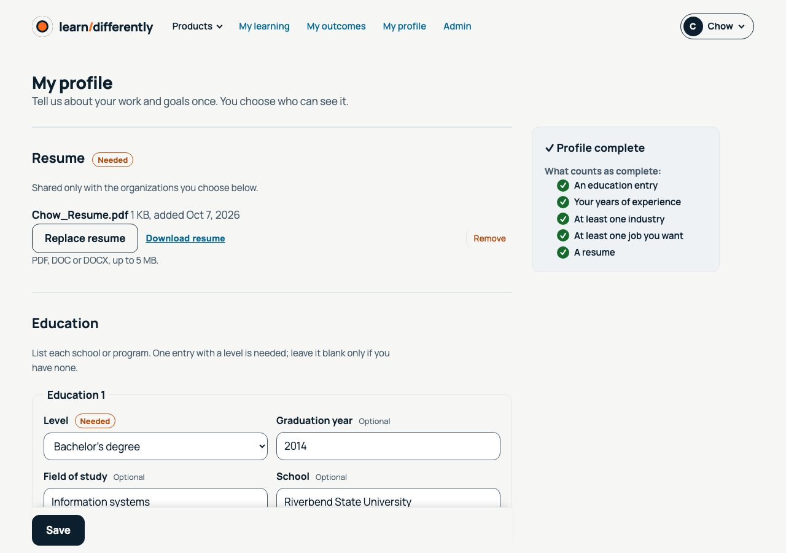

_Resume first, and a panel that shows what counts as complete._

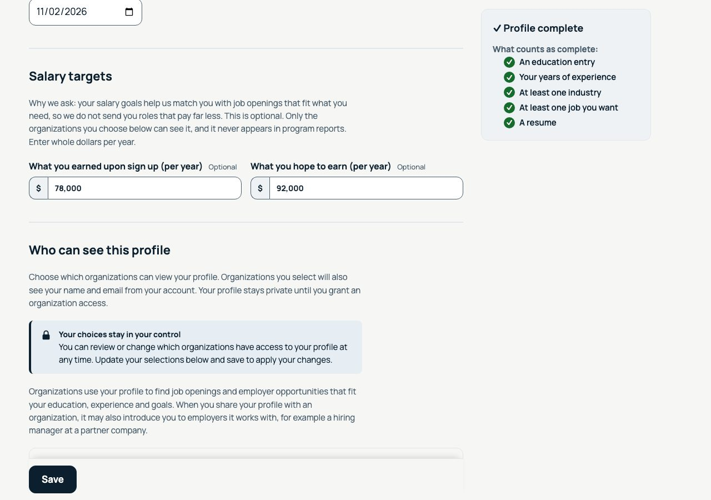

_Salary targets say why we ask._

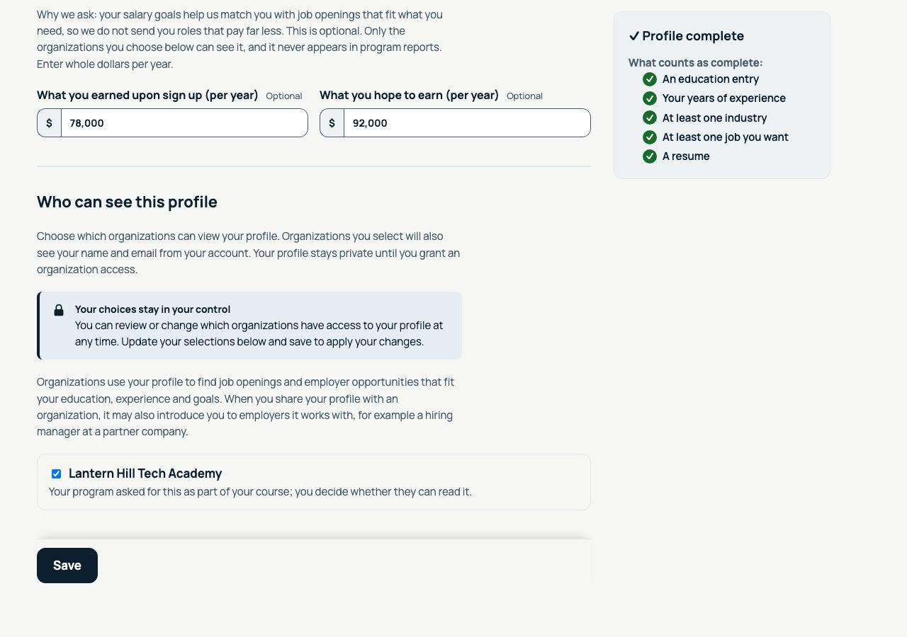

_The learner decides who can see it, and can change that any time._

---

## A cohort can require the profile, and a refresh

🟡 **In review** · Oct 7, 2026 · [PR #70](https://github.com/ludakhris/interview-differently/pull/70) · [Issue #69](https://github.com/ludakhris/interview-differently/issues/69)

On the cohort page, staff can tick "Learners must complete their profile first" and choose how often learners must refresh it (every 3, 6 or 12 months, or never). When it is on, "Your profile" appears as the first item in the learner's course, counts toward completion, and is marked done only while the profile is complete and fresh. When a refresh comes due, the item reopens with a note and My learning shows a small banner.

> **Good to know**
>
> - It is off by default; cohorts without it behave exactly as before.
> - It does not lock the rest of the course. It is required for completion, and shown first.
> - Learners still decide whether the organization can read the profile.

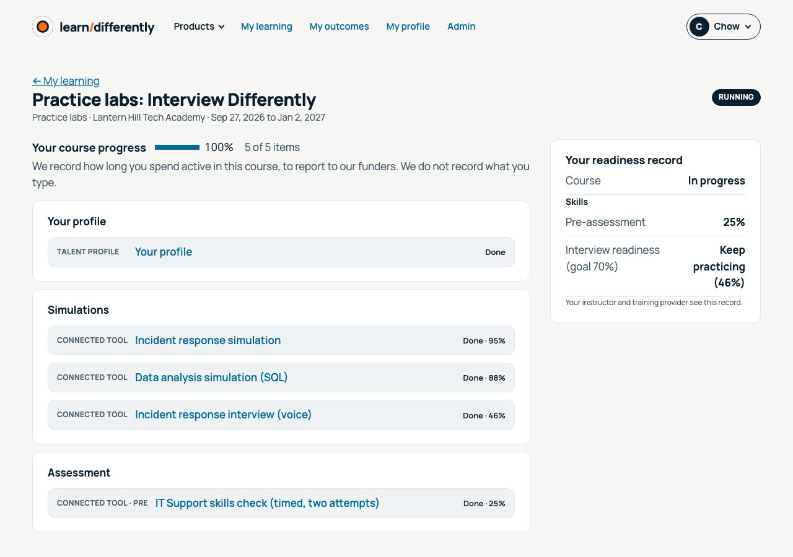

_"Your profile" as the first course item._

---

## Talent management for staff: notes, support follow-ups, search and export

🟡 **In review** · Oct 7, 2026 · [PR #70](https://github.com/ludakhris/interview-differently/pull/70) · [Issue #69](https://github.com/ludakhris/interview-differently/issues/69)

Provider staff get a Talent area. They can search and filter participants, open a profile, and keep private notes and support follow-ups (for example a bus pass or childcare) that follow the person across that provider's cohorts. A provider-wide support queue shows open items by status, assignee and due date. Staff can export shared profiles to a spreadsheet, with or without pay.

> **Good to know**
>
> - Notes and support items are never shown to the learner and never returned by any learner screen.
> - Only provider admins of that provider (and system admins) can read them. Every read or change is recorded in an access log, and nobody can read notes about themselves.
> - A person who did not share their profile shows as "Not shared", with only whether it is complete and up to date.

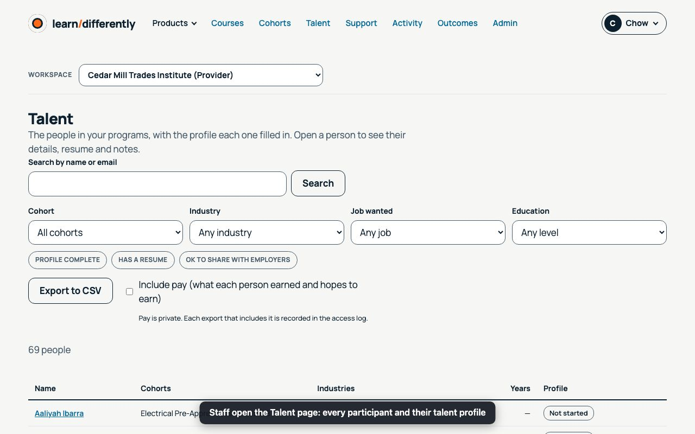

_Participants and their profile status._

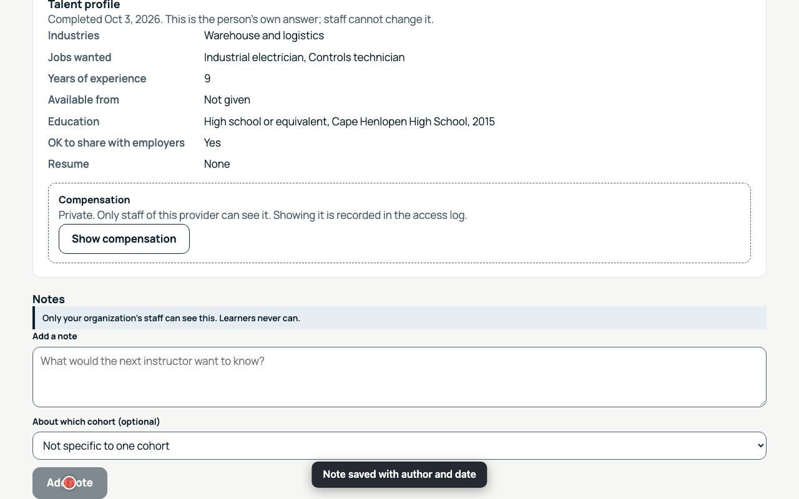

_Private notes, with a staff-only reminder._

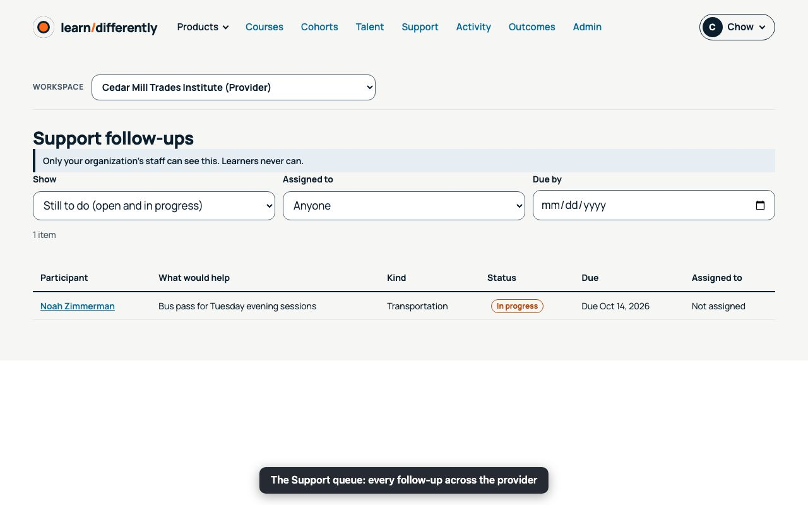

_Support queue across the provider._

---

## Attendance for live and hybrid cohorts

🟡 **In review** · Oct 7, 2026 · [PR #70](https://github.com/ludakhris/interview-differently/pull/70) · [Issue #69](https://github.com/ludakhris/interview-differently/issues/69)

Cohorts now say how they meet: online, live, or hybrid. For live and hybrid cohorts, an instructor adds a session in one tap, presses "Mark everyone present", and flips only the exceptions (absent, late, excused), with keyboard shortcuts for speed. A summary grid shows every learner across every session, and it exports to a spreadsheet.

> **Good to know**
>
> - The rate counts only sessions that were actually taken and that the learner was enrolled for; excused sessions are left out.
> - Learners see their own attendance line on the course page, never staff notes.

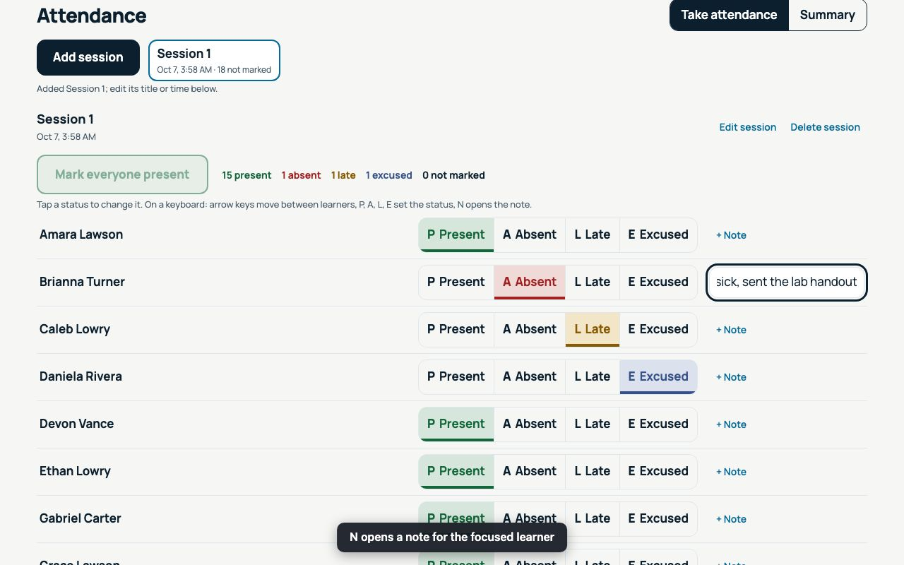

_Take attendance for a whole class._

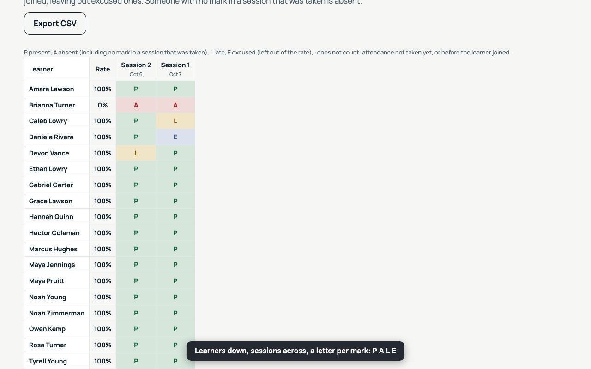

_Summary across sessions._

---

## Activity logs: active time per learner per day, for grant reporting

🟡 **In review** · Oct 7, 2026 · [PR #70](https://github.com/ludakhris/interview-differently/pull/70) · [Issue #69](https://github.com/ludakhris/interview-differently/issues/69)

For online courses, the learner pages now record how long each person is actively working, per item and per day. Staff get a cohort report with a daily chart, a learner table, a day-by-day log for one learner, and a CSV download. Time spent inside a connected tool is estimated from launch to score return and reported separately from measured time. Learners are told on the course page that their time is recorded.

> **Good to know**
>
> - It counts active time only (page open, visible, with recent input). Idle time is not counted.
> - Days are UTC days.

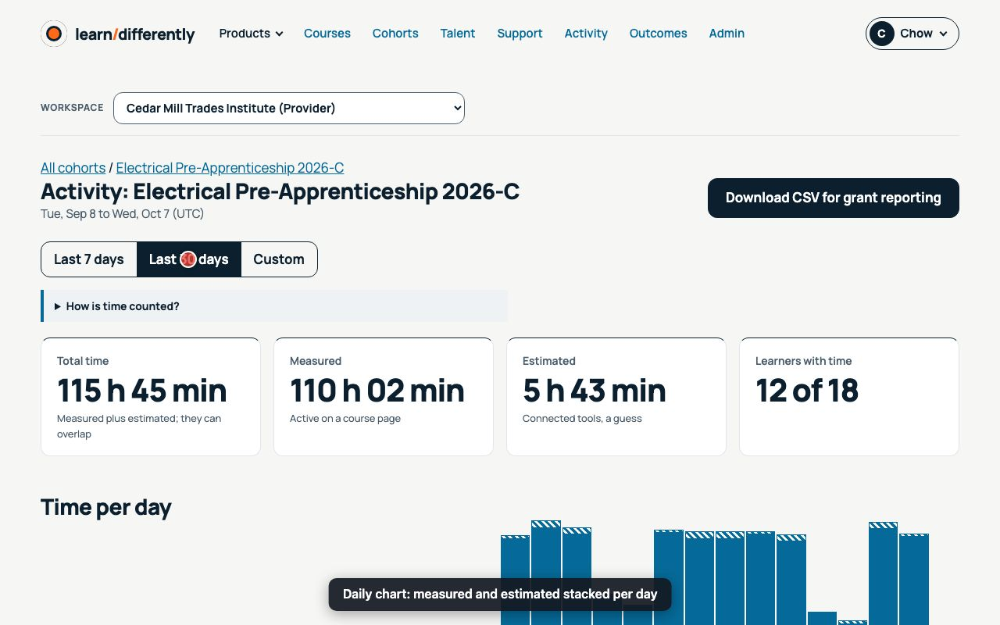

_Totals and daily chart._

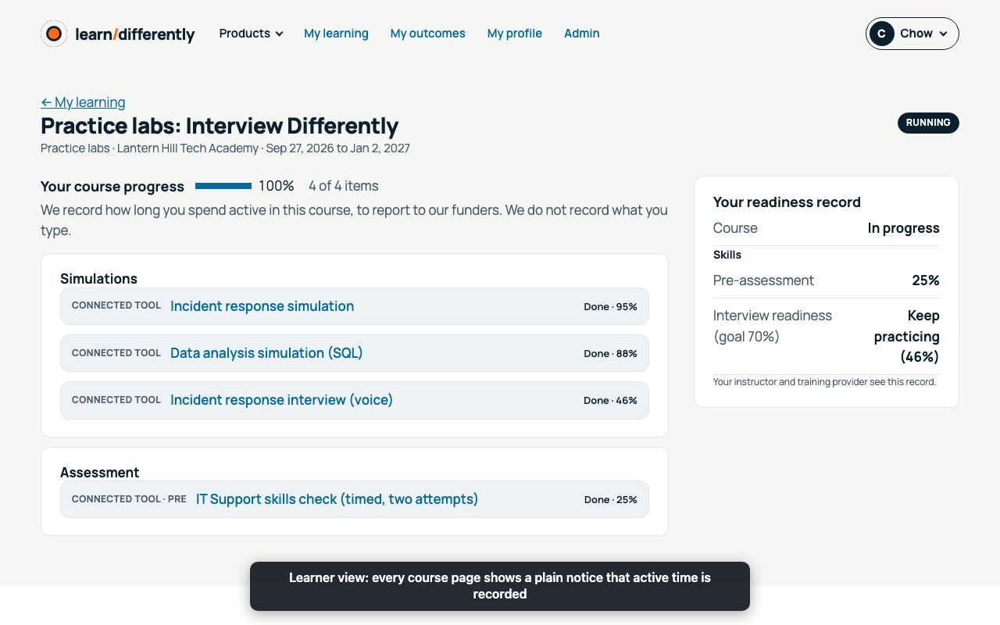

_The notice learners see._

---

## My outcomes: a learner's results across all their courses

🟡 **In review** · Oct 7, 2026 · [PR #70](https://github.com/ludakhris/interview-differently/pull/70) · [Issue #69](https://github.com/ludakhris/interview-differently/issues/69)

A new "My outcomes" page shows a learner their own progress and results across every cohort and course: how many items are done, best scores and attempts, interview readiness against the goal, and a timeline of recent results. Anything without a score reads "No score yet", never 0%.

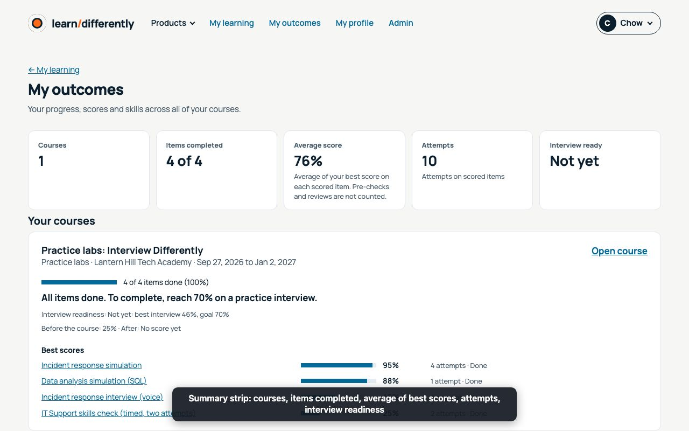

_Summary and course card._

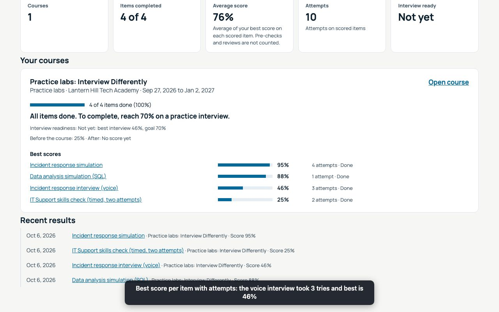

_Best scores and attempts per item._

---

## Optional admin approval for people who join with a code

🟢 **Shipped** · Oct 7, 2026 · [Issue #68](https://github.com/ludakhris/interview-differently/issues/68)

A cohort can now ask an admin to approve anyone who joins with its code. With approval on, joining creates a request instead of an enrollment. The learner sees that it is waiting and who to contact, and a small line on My learning shows what is pending. Staff see "Waiting for approval" above the roster with Approve and Decline.

> **Good to know**
>
> - Off by default. A contact line is required when it is on.
> - Pending people do not count as enrolled in rosters, seat counts or outcomes. Approving checks capacity again.

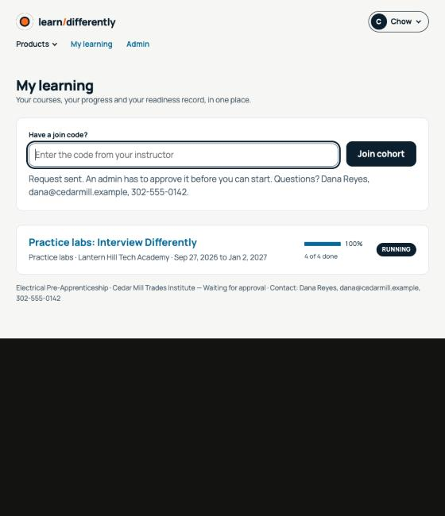

_What the learner sees._

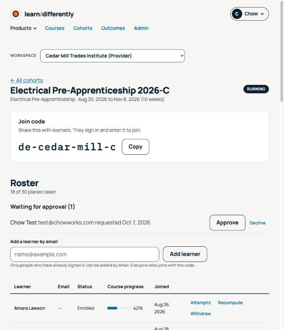

_What staff see._

---

## Every attempt's score is kept and shown

🟢 **Shipped** · Oct 7, 2026 · [Issue #67](https://github.com/ludakhris/interview-differently/issues/67)

Learners used to see only "Best score 59%, 4 attempts". Now each score a connected tool returns is logged, and the result screen has a collapsed "Your attempts" list with the date and score of each run. Staff can open the same list for any learner from the roster.

> **Good to know**
>
> - Attempts made before this shipped were never stored, so the list says how many earlier attempts were not recorded.

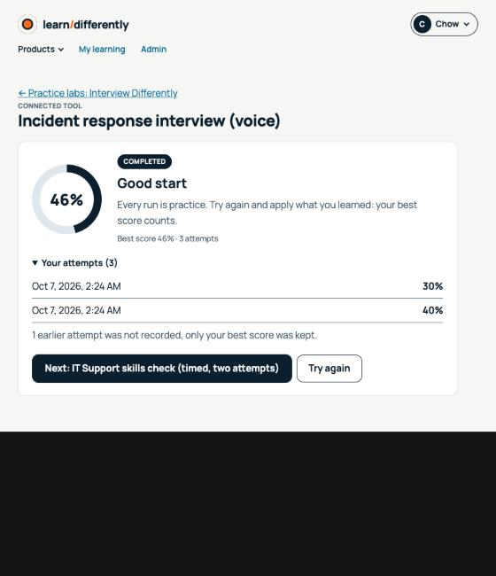

_The learner's attempts._

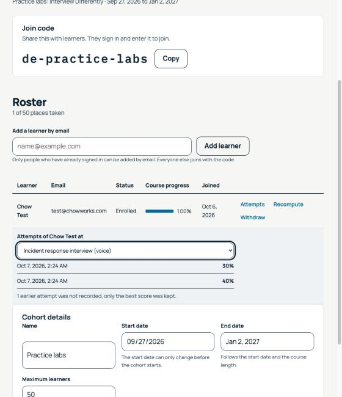

_Staff view from the roster._

---

## Interview Differently can register itself with a learning platform

🟢 **Shipped** · Oct 7, 2026 · [Issue #63](https://github.com/ludakhris/interview-differently/issues/63)

A learning platform can now register Interview Differently on its own, using the standard LTI Dynamic Registration steps. The platform arrives switched off and waits on a new Platforms page, where an admin approves or rejects it. A "How platforms work" dialog lists the exact addresses to give a platform.

> **Good to know**
>
> - A registration never enables itself. Each change is recorded in a history.
> - Interview Differently now supports more than one platform, found by issuer and client id.

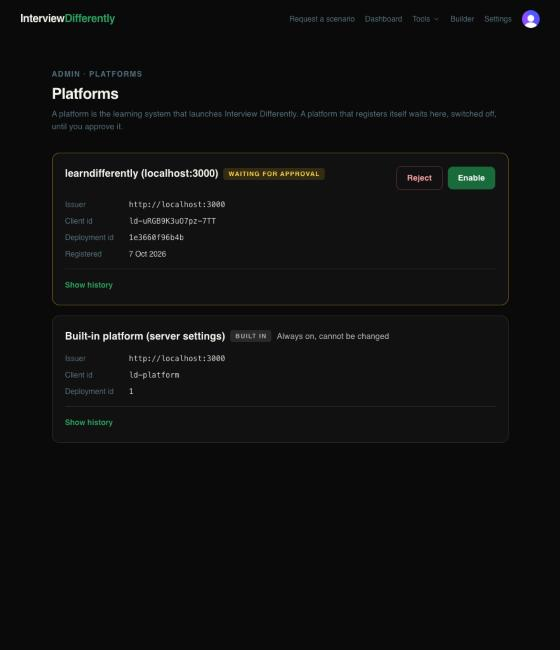

_A platform waiting for approval._

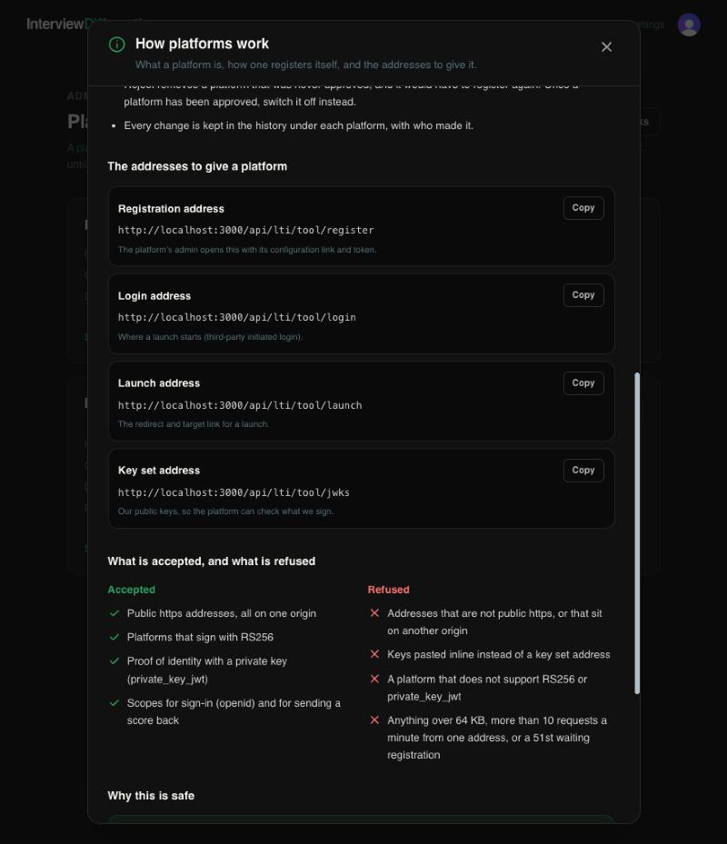

_The addresses to give a platform._

---

## Connected tools: a registry, registration by link, and change history

🟢 **Shipped** · Oct 7, 2026 · [Issue #63](https://github.com/ludakhris/interview-differently/issues/63)

LearnDifferently's connected tools now live in a registry that system admins manage: connections (one registration with a vendor) with tools under them, per-tool wording for the reference field, and limits on which workspaces may use each tool. A tool that supports Dynamic Registration can be added by pasting its registration link. Every change is kept in a searchable, day-grouped history, and a "How this works" dialog explains registration.

> **Good to know**
>
> - Only system admins can change tools. The two built-in tools are now seeded by a script, not at start-up.
> - A tool added by link arrives switched off.

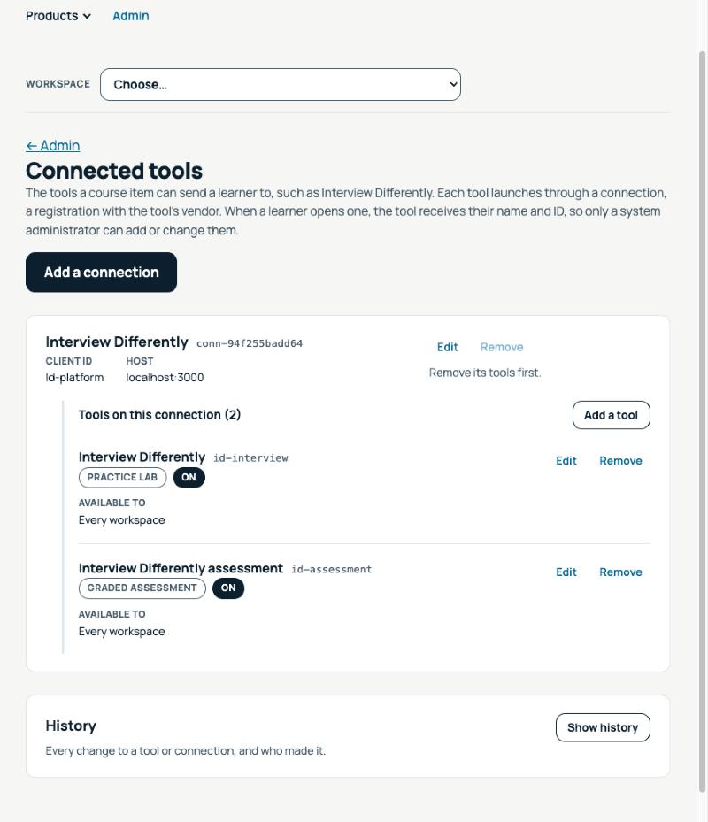

_Connections and their tools._

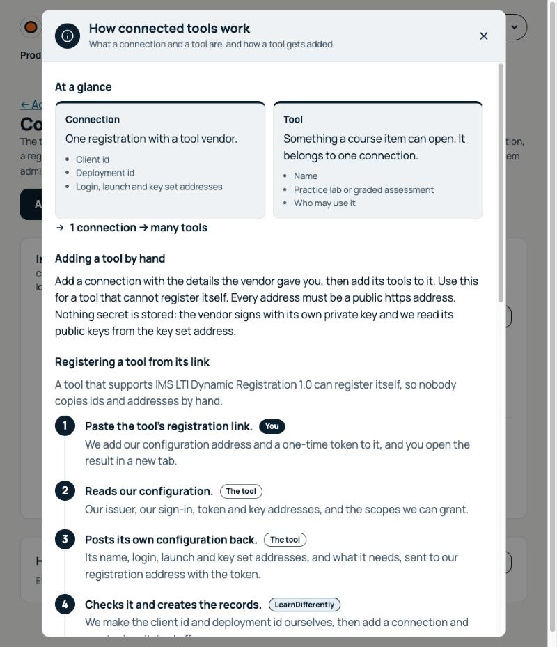

_How registration works._

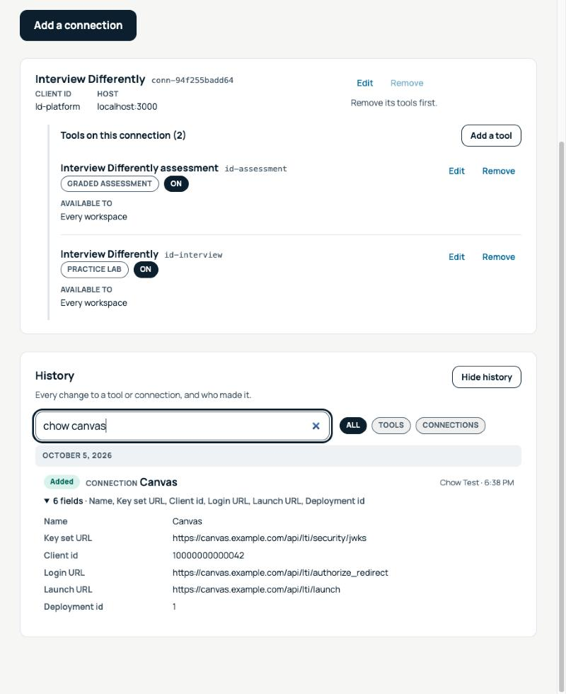

_Searchable change history._

---

## Scores are decided on the server, and learner SQL is bounded

🟢 **Shipped** · Oct 7, 2026 · [Issue #63](https://github.com/ludakhris/interview-differently/issues/63)

Text simulations launched from a course are now scored on the server from the learner's choices, so a score can no longer be made up in the browser. Learner SQL queries are limited in how long they can run and how much they can return.

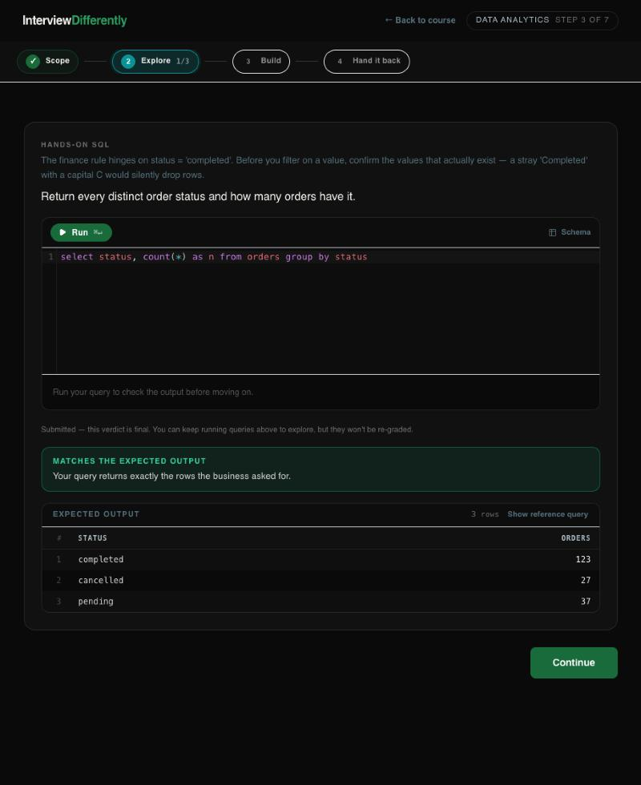

_SQL graded on the server._

---

## Voice interviews recover from silence and failed transcription

🟢 **Shipped** · Oct 7, 2026 · [Issue #63](https://github.com/ludakhris/interview-differently/issues/63)

If a learner's answer has no speech in it, or the transcription fails, the player now says so right away and asks them to record again, instead of ending in a 0% score or a long wait. Reloading the player marks the unfinished session as abandoned, and finishing an abandoned session gives its own clear message.

---

## Pass marks, and a course is complete only when the learner is ready

🟢 **Shipped** · Oct 6, 2026 · [Issue #63](https://github.com/ludakhris/interview-differently/issues/63)

A connected-tool item can have a pass mark, and "Done" then needs a good score. A course now completes only when every required item is done and the best practice interview reaches the course's readiness goal. The readiness record shows interview readiness as one line, and staff can recompute a learner's record (with the completion date corrected) from the roster. Finished tool items show a result screen with a score ring and a named next button.

> **Good to know**
>
> - Tool items are required unless the author marks them optional.

---

## LTI 1.3: Interview Differently launches from LearnDifferently and returns the score

🟢 **Shipped** · Oct 6, 2026 · [Issue #63](https://github.com/ludakhris/interview-differently/issues/63) · [LTI integration notes](../lti-integration.md)

LearnDifferently can now launch Interview Differently's simulations, SQL labs, voice interviews and timed assessments from a course item, in the same window, and the score comes back to the course. The launched screens wear the tenant's own branding, and the learner gets a "Back to course" link. Pre- and post-assessments run on Interview Differently's assessments, with retakes and per-item time limits.

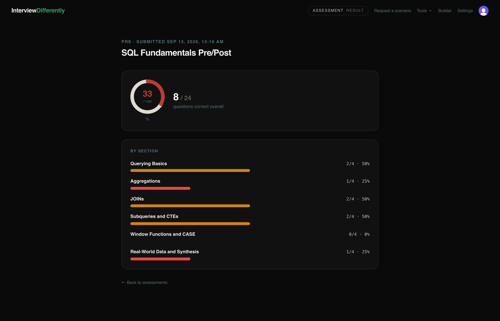

_An assessment result._

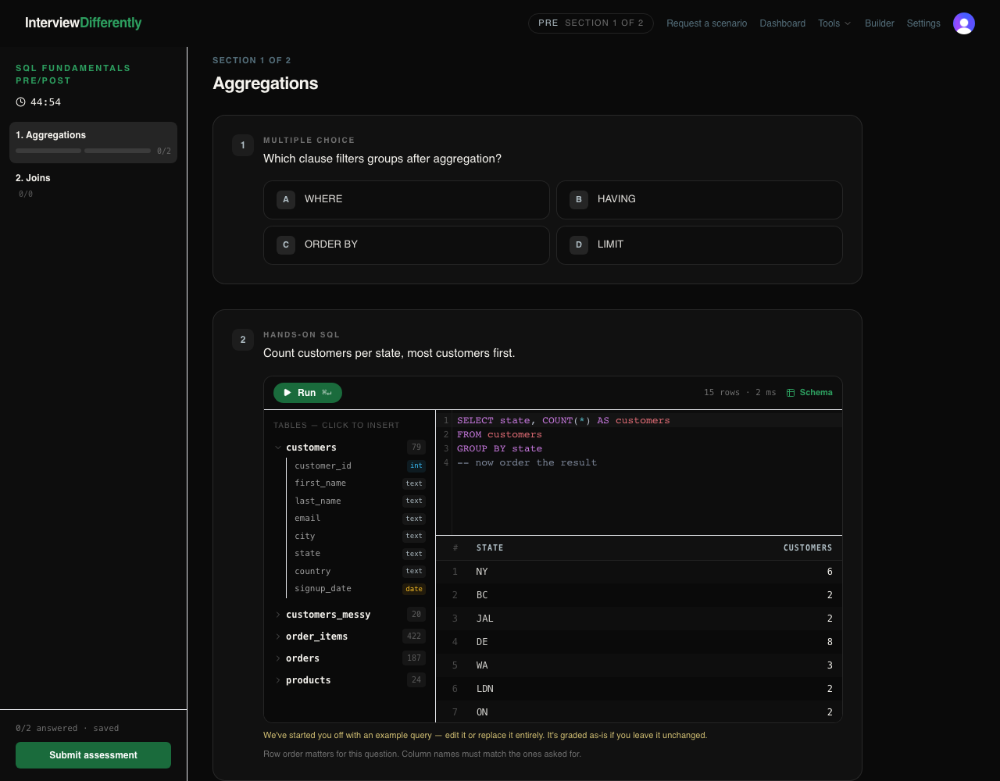

_A SQL lab._

---

## Adaptive plans, video and external content items

🟢 **Shipped** · Oct 6, 2026

Results can now add content to a learner's own plan: when a skill check shows a weak skill, the author's matching material is added for that learner and counted toward completion. Authors can also add YouTube video and external-link items to a course.

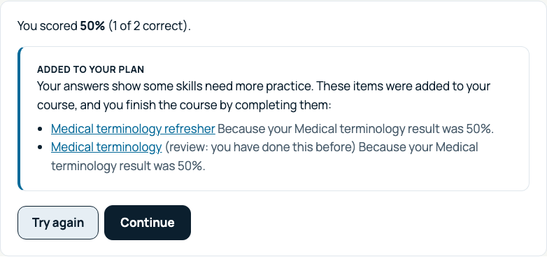

_A result that adds to the plan._

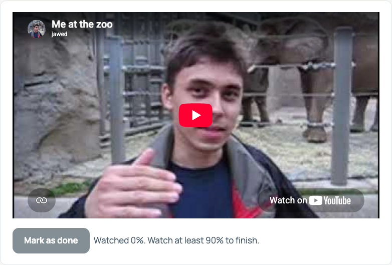

_A video item._

---

## Admin toolbox with user permissions

🟢 **Shipped** · Oct 6, 2026

System admins get an admin page that gathers the admin tools, including a user permissions screen to change someone's role (system admin, agency admin, provider admin and others). The workspace chooser also gained search and type filters, and shows the agency hierarchy with counts.

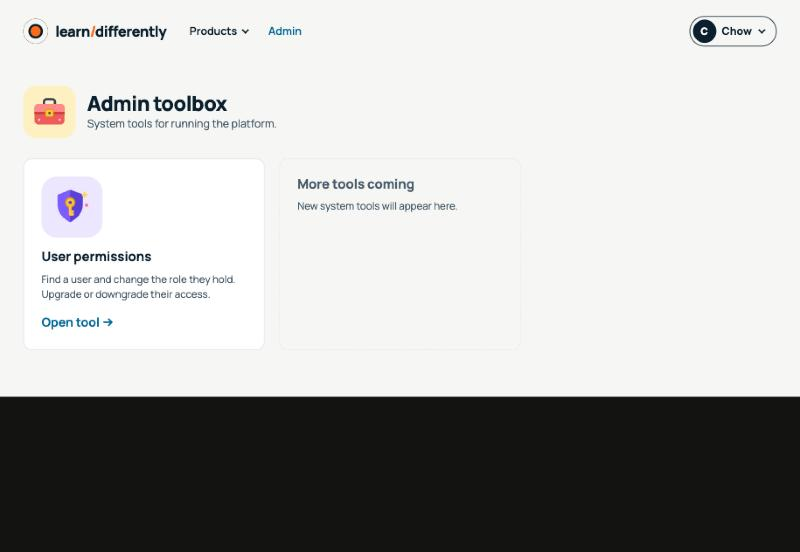

_The admin toolbox._

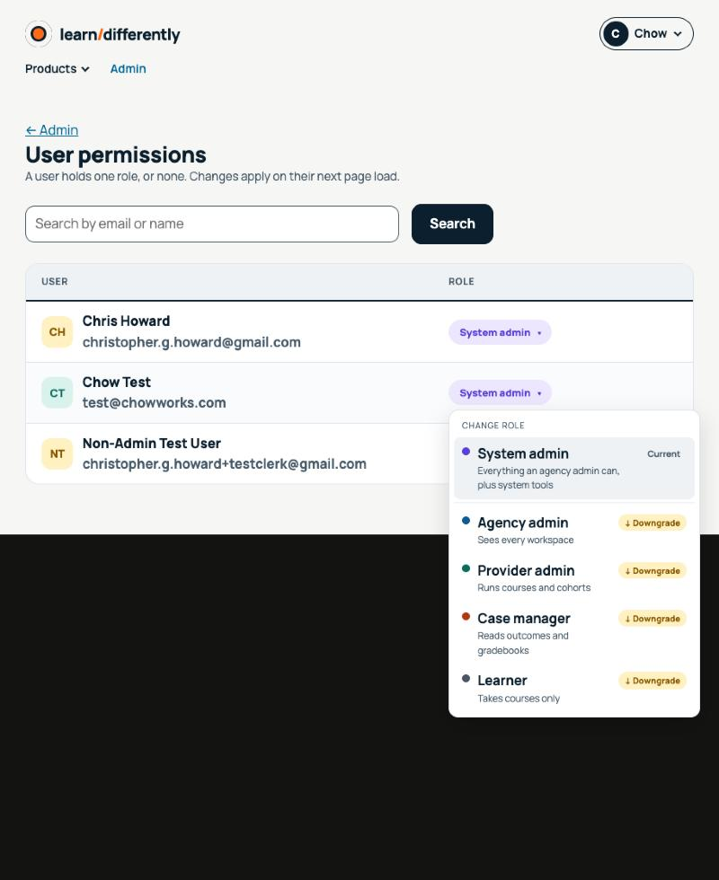

_Changing a role._
